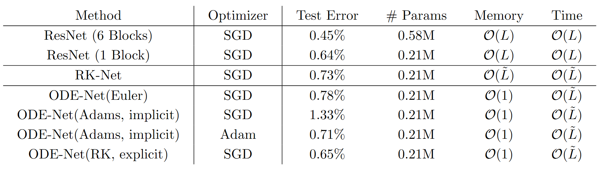
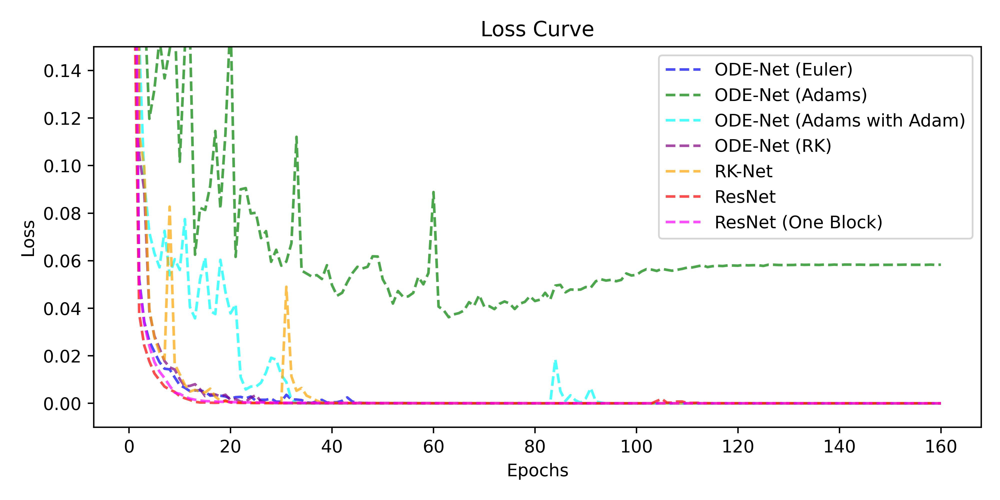

# Neural ODE
* Reproduction of Neural ODE with PyTorch (+Autograd)
* 대부분의 코드는 <a href="https://github.com/msurtsukov/neural-ode/tree/master">Reference(2)</a>를 참고했습니다.
* 또한, Neural ODE 자체가 어려운 알고리즘을 감안하여 본 작업들의 주석은 한국어로 작성하였습니다.
* OfficialNeuralODE는 <code>torchdiffeq</code>라는 Neural ODE 공식 repo를 사용했습니다. (Implicit Adam's method를 사용하기 위해)
* 그리고, 다른 NeuralODE는 <a href="https://github.com/msurtsukov/neural-ode/tree/master">Reference (2)</a>에서 가져온 것으로 간단한 ODE Solver인 Euler's method로 구현된 것이고, Adjoint sensitivity method의 구현, <code>torch.autograd.Function</code>. <code>torch.autograd.grad</code>를 이해하고자 했습니다.

# Environments
```
conda create -n node python=3.12
conda activate node
pip install -r requirements.txt
```

# Experiement (25.12.25)
* 논문의 3번 Section (Replacing Residual Networks with ODEs for supervised learning)을 재현하고자 했다.



* 결과는 위 테이블과 같다. 먼저 논문에서 보여준 성능과 비슷하게 재현되었는지 조사했다. ResNet(6 Blocks)의 성능은 유사하게 도출되었다. 하지만, Neural ODE 기반 모델의 성능은 논문 대비 감소하였다. (RK-Net 포함) 하지만, 그 차이 폭이 실험 별로 대략 0.2X%를 나타낸다. 이에 따라 잘못된 구현은 아님을 시사한다. (다만, 차이점이 하나 있다. ResNet을 구현하면서 Residual Blocks -> Normalization -> ReLU를 거쳐야 하는데, 실수로 ReLU를 넣지 않았다. 실험 중에 발견한 일이라 나머지 Neural ODE 기반 모델 또한 결과의 동등성을 위해 ODE Block -> Normalization -> ReLU 구조에서 ReLU를 뺐다. -> 그래서, 결과 간 공정성은 유지하도록 했다.)



* 그리고, ODE-Net 실험을 하면서 모호했던 부분이 ODE Solver 선택이었다. 논문에서는 Implicit Adam's method, 공식 레포지토리에서는 Explicit Runge-Kunta method (<code>dopri5</code>) 사용했다. 그래서, 두 ODE Solver를 기반으로 모두 학습하여 재현했다. 하지만, 이 과정에서 Implicit Adams method 학습에 문제가 있었다. 위 그림과 같이 Implicit Adams method (초록색) 기반 학습이 상당히 불안정했으며, 전역 극소값이 아닌 곳에서 수렴한 것으로 추측된다. 이를 완화하기 위해 Optimizer를 Adam으로 바꿔 다시 학습을 했으며, adaptive learning rate를 통해 안정화된 학습을 유도했다. 이를 통해 Explicit Runge-Kunta method와 Implicit Adams method의 차이를 분석해볼 필요가 있었다.
    
    ➡️ <b>ODE Solver 간 차이를 공부해볼 것.</b>

* 


# References

1. Reference (1): https://github.com/rtqichen/torchdiffeq

2. Reference (2): https://github.com/msurtsukov/neural-ode/tree/master